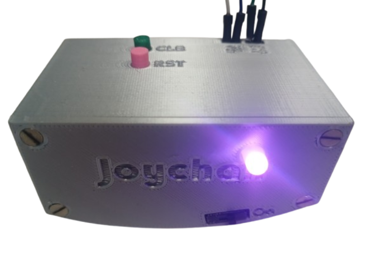

# Joychair - Interface for VR Navigation

Welcome to the Joychair Interface project! This project integrates the movements of an [Aeris Swopper chair](https://en.aeris.de/products/aeris-swopper-wollmischung-capture-gruen) into virtual reality (VR) environments, allowing users to navigate virtual worlds by shifting their weight on the chair. The idea is inspired by the concept of ChairIO, as described in the paper ["ChairIO - the Chair-Based Interface"](https://www.researchgate.net/publication/233819716_ChairIO--the_Chair-Based_Interface).

## Project Overview

The Joychair Interface project is developed at the iXperience Lab of the Faculty of Computer Science and Business Information Systems. The goal is to capture the movements of the Aeris Swopper chair and integrate them into a solution that can be used within VR environments, particularly in Unity.

The project was developed using the PlatformIO plugin for VSCode. The libraries used are also available for ArduinoIDE. The recommended version for wireless support is the ESP32 version; for wired, use the Arduino one.

## Project Components

### Hardware Parts
- M2.5 Machine Screws and Nuts
- 2000mAh Battery
- SPDT Slide Switch
- JST-PH (Male)
- JST-PH (Female)
- JST-PH extension cable (optional but helpful)
- Buzzer (active or passive)
- RGB LED (optional LED)
- MPU6050 (Inertial Measurement Unit)
- Compatible microcontroller (e.g., ESP32, Arduino)

### Hardware Setup

The project uses microcontroller boards with an IMU sensor attached to the chair. The IMU captures the chair's movements, which are then transmitted wirelessly or via wired connections.

- [Arduino Leonardo Setup](./arduino_leonardo)
- [ESP32 Setup](./esp32)
- [Feather 32u4 Bluefruit LE Setup](./feather32u4_bluefruit_le)

### Unity Integration

In Unity, the output is used to control the user's movement within the VR environment. By shifting their weight on the chair, users can navigate virtual worlds seamlessly.

## Setup Instructions

To set up the Joychair Interface project, follow these steps:

1. **Hardware Setup**: Attach the IMU sensor to the Aeris Swopper chair as per the instructions provided.
2. **Microcontroller Configuration**: Program the microcontroller board to read data from the IMU and transmit it wirelessly or via a wired connection.
3. **Unity Integration**: Import the output into Unity and configure the VR environment to respond to the chair's movements for navigation.
4. **Optional Casing**: For battery integration, follow a rechargeable battery tutorial. CAD for ESP32 is in progress.

## Features and Functionalities

The Joychair Interface provides several key functionalities:

### Initialization

- **MPU6050 Setup**: Initializes the MPU6050 IMU and ensures connectivity. Plays an initialization sound to confirm startup.

### Connection Management

- **Continuous Monitoring**: Checks the connection to the MPU6050 sensor and attempts to reconnect if the connection is lost, ensuring stable operation.

### Data Processing

- **Sensor Data Acquisition**: Reads data from the IMU, including yaw, pitch, and roll.
- **Axis Mapping**: Maps the processed sensor data to joystick axes (X, Y, Z, RX, RY, RZ) for VR navigation.

### Calibration and Direction Declaration

- **Sitting Detection**: Waits for the user to sit by monitoring acceleration in the Z-axis to exceed a threshold.
- **Forward Tilt Calibration**: Prompts the user to tilt forward to calibrate the forward direction. Plays a success sound upon completion.

### Joystick Output

- **Real-time Axis Mapping**: Continuously updates joystick inputs based on chair movement.
- **Deadzone Application**: Applies deadzones to joystick inputs to filter out noise and minor movements.

### Visual and Auditory Feedback

- **LED Indicators**: Uses RGB LED to provide visual status indicators, including connection status and error notifications.
- **Buzzer Sounds**: Emits sounds for different events such as initialization, errors, success, and setup completion.

### Battery Level Monitoring

- **Analog Reading**: Reads the battery level via Sparkfun Fuel Gauge

### Additional Functionalities

- **Jump Detection**: Detects rapid acceleration changes to emulate a "jump" button press.
- **Recalibration Button**: Allows recalibration of the forward direction by pressing a designated button on the microcontroller.
- **Reset Button**: Allows to reset the microcontroller.

## Axis Mapping and Joystick Calibration

When integrating the Joychair with a VR environment, it is essential to adjust the axis mappings to suit the target application's requirements. The joystick values, derived from the MPU6050 sensor readings, must be mapped within the appropriate intervals for your setup.

### Adjusting Axis Mapping

The mapping of the pitch, roll, and yaw values to joystick inputs is critical for achieving smooth and intuitive navigation. Depending on the VR application's sensitivity and control scheme, you may need to calibrate the mapping intervals.

1. **Define the Mapping Range:**
   - Determine the minimum and maximum tilt angles corresponding to the joystick's minimum and maximum values. This range should reflect the comfortable and natural tilting limits of the Aeris Swopper chair.

2. **Adjust the Intervals:**
   - Modify the code to map the sensor readings to the joystick values. Ensure the mapping intervals match the expected input range of your VR application. For instance, if your application expects joystick values from 0 to 32767, you need to map the sensor's tilt range to this interval.

3. **Minimum Tilt Threshold:**
   - Set a minimum tilt threshold to ensure that only intentional movements result in joystick input. This threshold helps filter out minor, unintentional shifts and maintains a stable VR navigation experience.

### Example Code Snippet for Axis Mapping

```cpp
// Define the minimum and maximum tilt angles (in degrees)
const float minTiltAngle = -10.0;
const float maxTiltAngle = 10.0;

// Define the joystick input range
const int joystickMinValue = 0;
const int joystickMaxValue = 32767;

// Function to map tilt to joystick value
int mapTiltToJoystick(float tiltAngle) {
    return map(tiltAngle, minTiltAngle, maxTiltAngle, joystickMinValue, joystickMaxValue);
}

// Example usage in the main loop
void loop() {
    // Get the tilt angles from the MPU6050
    float pitch = ...; // Get the pitch angle
    float roll = ...;  // Get the roll angle

    // Map the tilt angles to joystick values
    int joystickX = mapTiltToJoystick(pitch);
    int joystickY = mapTiltToJoystick(roll);

    // Apply the mapped values to the joystick
    bleGamepad.setAxes(joystickX, joystickY, ...);
}
```
## Additional Info ##

### Battery Level

LED Blink Red: Battery below 20%  
LED Blink Yellow: Battery over 20%   
LED Blink Green: Battery over 50%  

### Example



## Additional Resources

- [Aeris Swopper Product Page](https://en.aeris.de/products/aeris-swopper-wollmischung-capture-gruen): Learn more about the Aeris Swopper chair.
- [Arduino Joystick Tutorial](https://www.instructables.com/Create-a-Joystick-Using-the-Arduino-Joystick-Libra/): Useful guide for setting up the Arduino Leonardo as a joystick.
- [MPU6050 Wiring Guide](https://images.app.goo.gl/LdwjNLMtsEHgnhpH7): How to wire MPU6050
- [Buzzer Wiring Guide](https://images.app.goo.gl/mgFJdeP5EhSxzM8t5): How to wire a buzzer
- [RGB-LED Wiring Guide](https://images.app.goo.gl/b1UZzW2y5GSzTEi26): How to wire an RGB-LED
- [Rechargeable Battery Integration](https://learn.adafruit.com/3d-printed-case-for-adafruit-feather/assembly): How to wire a rechargeable battery  

## Contributors

- Sam Weiler (@zamweis)

## License

This project is licensed under the MIT License. See the [LICENSE](LICENSE) file for details.

---

Feel free to reach out to the project team for any questions or feedback. Happy navigating in VR with Joychair Interface! 🎮🪑🌐
