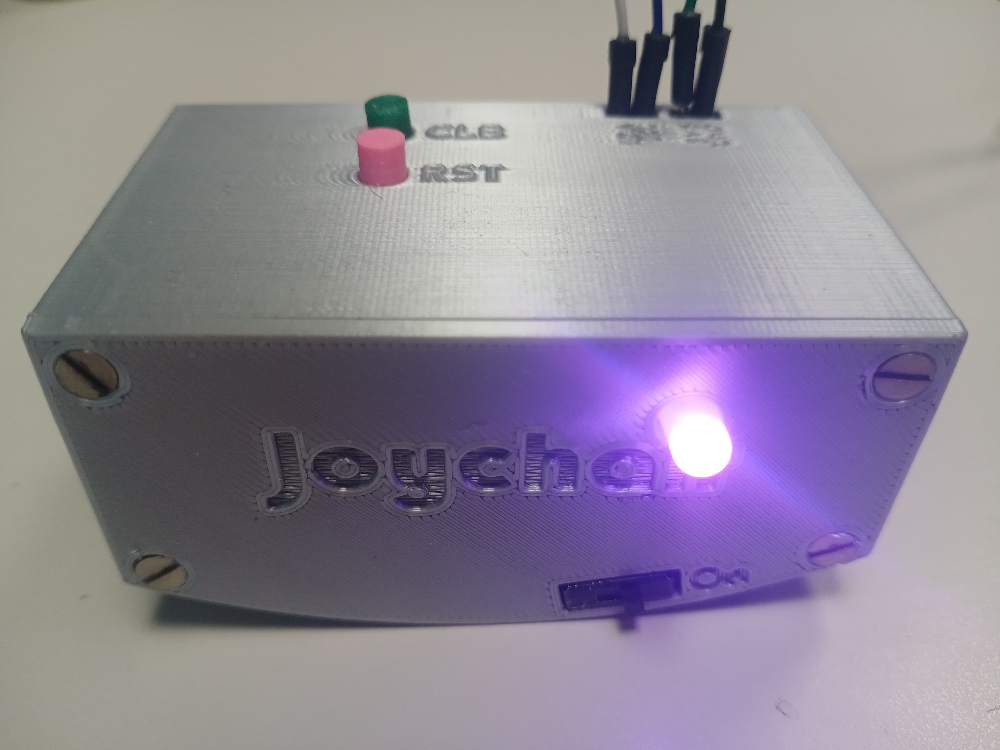

# Joychair - Interface for VR Navigation

Welcome to the Joychair Interface project! This project aims to integrate the movements of an [Aeris Swopper chair](https://en.aeris.de/products/aeris-swopper-wollmischung-capture-gruen) into virtual reality (VR) environments, allowing users to navigate virtual worlds by shifting their weight on the chair. The idea behind this project is inspired by the concept of ChairIO, as described in the paper ["ChairIO - the Chair-Based Interface"](https://www.researchgate.net/publication/233819716_ChairIO--the_Chair-Based_Interface).

## Project Overview

The Joychair Interface project is being developed at the iXperience Lab of the Faculty of Computer Science and Business Information Systems. The goal is to capture the movements of the Aeris Swopper chair and integrate them into a solution that can be used within VR environments, particularly in Unity.

The project was done with PlatformIO plugin for VSCode. The used libraries are also available for ArduinoIDE.  

## Project Components

### Hardware Parts
- M2.5 Machine Screws and Nuts
- 2000mAh Battery
- SPDT Slide Switch
- JST-PH (Male)
- JST-PH (Female)
- JST-PH extension cable (optional but easier)
- Buzzer (active or passive)
- RGB-LED (optional LED)
- MPU6050
- Compatible microcontroller

### Hardware Setup

The project utilizes different microcontroller boards along with sensors, such as an Inertial Measurement Unit (IMU), attached to the chair. The IMU captures the chair's movements, which are then transmitted wirelessly or via wired connections.

- [Arduino Leonardo Setup](./arduino_leonardo)
- [ESP32 Setup](./esp32)
- [Feather 32u4 Bluefruit LE Setup](./feather32u4_bluetfruit_le)

### Unity Integration

In Unity, the output is used to control the user's movement within the VR environment. By shifting their weight on the chair, users can navigate through virtual worlds seamlessly.

## Setup Instructions

To set up the Joychair Interface project, follow these steps:

1. **Hardware Setup**: Attach the IMU sensor to the Aeris Swopper chair as per the instructions provided.
2. **Microcontroller Configuration**: Program the microcontroller board to read data from the IMU and transmit it wirelessly or via a wired connection.
3. **Unity Integration**: Import the output into Unity and configure the VR environment to respond to the chair's movements for navigation.
4. **Optional Casing**: For battery integration, follow a rechargeable battery tutorial. CAD for ESP32 is in progress.

## Basic Functionality

The code for this project performs several key functions:

1. **Initialization**: Sets up the MPU6050 IMU and the joystick library, and plays an initialization sound.
2. **Connection Check**: Continuously checks if the MPU6050 is connected and tries to reconnect if the connection is lost.
3. **Data Processing**: Reads data from the IMU, calculates yaw, pitch, and roll, and maps these values to joystick axes.
4. **Calibration and Direction Declaration**: Waits for the player to sit down by detecting a sufficient acceleration threshold. Once seated, the player is prompted to tilt forward for a few seconds to calibrate the forward direction. After holding the tilt for the calibration duration, the forward direction is defined.
5. **Joystick Output**: Maps the processed data to joystick inputs for VR navigation and applies deadzones to filter out noise.

### Calibration and Direction Declaration

1. **Wait for Player to Sit**: The system waits until the acceleration in the Z-axis exceeds the sitting threshold.
2. **Tilt Forward to Calibrate**: Once the player is seated, they are prompted to tilt forward and hold the position for a few seconds. If the tilt is held for the required calibration duration, the system calculates the relative angle and sets the forward direction.
3. **Forward Direction Defined**: After successful calibration, the system plays a setup complete sound and indicates that the forward direction is defined.
## Axis Mapping and Joystick Calibration

When integrating the Joychair with a VR environment, it is essential to adjust the axis mappings to suit the target application's requirements. The joystick values, which are derived from the MPU6050 sensor readings, must be mapped within the appropriate intervals for your setup.

### Adjusting Axis Mapping

The mapping of the pitch, roll, and yaw values to joystick inputs is critical for achieving smooth and intuitive navigation. Depending on the VR application's sensitivity and control scheme, you may need to calibrate the mapping intervals.

1. **Define the Mapping Range:**
   - Determine the minimum and maximum tilt angles that correspond to the joystick's minimum and maximum values. This range should reflect the comfortable and natural tilting limits of the Aeris Swopper chair.

2. **Adjust the Intervals:**
   - Modify the code to map the sensor readings to the joystick values. Ensure that the mapping intervals match the expected input range of your VR application. For instance, if your application expects joystick values from 0 to 32767, you need to map the sensor's tilt range to this interval.

3. **Minimum Tilt Threshold:**
   - Set a minimum tilt threshold to ensure that only intentional movements result in joystick input. This threshold helps filter out minor, unintentional shifts and maintains a stable VR navigation experience.

### Example Code Snippet for Axis Mapping

```cpp
// Define the minimum and maximum tilt angles (in degrees)
const float minTiltAngle = -10.0;
const float maxTiltAngle = 10.0;

// Define the joystick input range
const int joystickMinValue = 0;
const int joystickMaxValue = 32767;

// Function to map tilt to joystick value
int mapTiltToJoystick(float tiltAngle) {
    return map(tiltAngle, minTiltAngle, maxTiltAngle, joystickMinValue, joystickMaxValue);
}

// Example usage in the main loop
void loop() {
    // Get the tilt angles from the MPU6050
    float pitch = ...; // Get the pitch angle
    float roll = ...;  // Get the roll angle

    // Map the tilt angles to joystick values
    int joystickX = mapTiltToJoystick(pitch);
    int joystickY = mapTiltToJoystick(roll);

    // Apply the mapped values to the joystick
    bleGamepad.setAxes(joystickX, joystickY, ...);
}
```
## Info ##

### Battery Level

Currently, the battery level measurement functionality is not working correctly with my SparkFun ESP32 Thing.

### Example



## Additional Resources

- [Aeris Swopper Product Page](https://en.aeris.de/products/aeris-swopper-wollmischung-capture-gruen): Learn more about the Aeris Swopper chair.
- [Arduino Joystick Tutorial](https://www.instructables.com/Create-a-Joystick-Using-the-Arduino-Joystick-Libra/): Useful guide for setting up the Arduino Leonardo as a joystick.
- [MPU6050 Wiring Guide](https://images.app.goo.gl/LdwjNLMtsEHgnhpH7): How to wire MPU6050
- [Buzzer Wiring Guide](https://images.app.goo.gl/mgFJdeP5EhSxzM8t5): How to wire a buzzer
- [RGB-LED Wiring Guide](https://images.app.goo.gl/b1UZzW2y5GSzTEi26): How to wire an RGB-LED
- [Rechargeable Battery Integration](https://learn.adafruit.com/3d-printed-case-for-adafruit-feather/assembly): How to wire a rechargeable battery  

## Contributors

- Sam Weiler (@zamweis)

## License

This project is licensed under the MIT License. See the [LICENSE](LICENSE) file for details.

---

Feel free to reach out to the project team for any questions or feedback. Happy navigating in VR with Joychair Interface! 🎮🪑🌐
